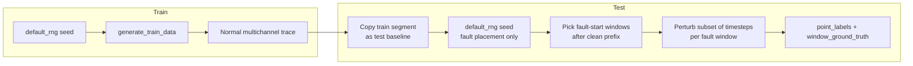

# Autoencoder Anomaly Detection (Sensor POC)

Proof-of-concept for multichannel sensor anomaly detection using a **1D convolutional autoencoder** in TensorFlow/Keras. The model learns to reconstruct **normal** sliding windows; windows or timesteps with high reconstruction MSE are flagged as anomalies.

**Channels:** `current`, `voltage`, `power_factor`, `active_power`  
**Default window size:** 50 timesteps

---

## Requirements

- Python 3.10+
- See `requirements.txt` (runtime) and `requirements-dev.txt` (pytest)

```bash
python -m venv .venv
source .venv/bin/activate
pip install -r requirements.txt
pip install -r requirements-dev.txt   # optional, for tests
```

---

## Quick start

**Synthetic demo** (no CSV; generates train/test with injected faults):

```bash
python autoencoder_anomaly_detection.py
```

**Custom CSV** (columns: `current`, `voltage`, `power_factor`, `active_power`; optional `is_anomaly`):

```bash
python autoencoder_anomaly_detection.py --data /path/to/sensors.csv
```

**Run tests:**

```bash
pytest -q
```

Plots are written to `plots/` by default (`training_loss.png`, `train_window_mse.png`, `test_window_mse.png`).

---

## High-level execution flow

```mermaid
flowchart TD
    Start([main]) --> Parse[Parse CLI arguments]
    Parse --> Load[load_sensor_data]

    Load --> Src{Data source?}
    Src -->|No --data| Synth[generate_synthetic_dataset]
    Src -->|CSV path| CSV[Read CSV + train/test split]

    Synth --> SynthDetail[Train: normal trace only<br/>Test: copy train prefix + inject faults<br/>in later windows]
    SynthDetail --> Describe[describe_synthetic_split]
    CSV --> WindowGT[window_labels from is_anomaly]

    Describe --> Prep
    WindowGT --> Prep[Build sliding windows<br/>window_sensor_data]

    Prep --> Filter{--train-normal-only?}
    Filter -->|yes| DropAnom[Keep only windows with<br/>no fault timesteps in train]
    Filter -->|no| Scale
    DropAnom --> Scale

    Scale[RobustScaler fit on train<br/>Transform train + test windows] --> Build[build_autoencoder Conv1D]
    Build --> Fit[model.fit train→train<br/>validation_split=0.1]

    Fit --> Mode{--scoring-mode}

    Mode -->|window or both| WinPath[Window-level path]
    Mode -->|timestep or both| TsPath[Timestep-level path]

    WinPath --> WinMSE[reconstruction_errors<br/>per-window MSE]
    WinMSE --> WinTh[fit_window_thresholds<br/>train: all train windows<br/>test: clean or all windows]
    WinTh --> WinDet[Flag if MSE > threshold]
    WinDet --> WinReport[Print MSE stats + detection counts]

    TsPath --> TsMSE[window_timestep_errors<br/>aggregate max/mean per timestep]
    TsMSE --> TsTh[fit_timestep_threshold<br/>train or clean test timesteps]
    TsTh --> TsDet[Flag timesteps → rollup to windows]
    TsDet --> TsReport[Print timestep/window counts]

    WinReport --> Plot{--no-plot?}
    TsReport --> Plot
    Plot -->|no| Eval
    Plot -->|yes| SavePNG[Save plots to --plot-dir]
    SavePNG --> Eval

    Eval{Synthetic labels?} -->|yes| Metrics[Precision / recall / confusion]
    Eval -->|no| End([Done])
    Metrics --> End
```



---

## Synthetic data generation (overview)



- **Train:** all normal; used only for learning reconstruction.
- **Test:** duplicate of early train timesteps, then sparse timestep-level faults in later windows.
- **`--test-clean-prefix-windows`:** reserve the first N test windows with no injected fault timesteps (default `2 × window_size`).

---

## Detection logic (summary)

| Stage | Description |
|--------|-------------|
| **Training** | Autoencoder minimizes MSE between input window and reconstruction (unsupervised on train). |
| **Scoring** | Reconstruction MSE per window and/or per timestep (inside overlapping windows). |
| **Threshold** | `threshold = μ + k×σ` on a calibration set (`k` from `--threshold-std` or split-specific flags). |
| **Window test threshold** | Separate train vs test calibration; test uses `--window-test-calibrate-on clean` (default) or `all`. |
| **Flagging** | Strict `MSE > threshold` → anomalous. |

---

## Notable CLI options

| Flag | Default | Purpose |
|------|---------|---------|
| `--data` | synthetic | Path to CSV or omit for demo data |
| `--window-size` | 50 | Sliding window length |
| `--epochs` | 30 | Training epochs |
| `--threshold-std` | 3.0 | Base σ multiplier for thresholds |
| `--window-threshold-std` | same | Window-level k |
| `--timestep-threshold-std` | same | Timestep-level k |
| `--scoring-mode` | both | `window`, `timestep`, or `both` |
| `--window-test-calibrate-on` | clean | Test window threshold: `clean` or `all` |
| `--threshold-calibrate-on` | train | Timestep threshold: `train` or `test_normal` |
| `--test-anomaly-fraction` | 0.2 | Synthetic: fraction of fault-start test windows |
| `--test-clean-prefix-windows` | 2×window | Synthetic: initial clean test windows |
| `--anomaly-magnitude` | small | Synthetic fault strength: small / medium / large |
| `--train-normal-only` | off | Drop train windows with any labeled fault timestep |
| `--plot-dir` | plots | Output directory for figures |
| `--no-plot` | off | Skip plot generation |
| `--seed` | 42 | Reproducibility |

---

## Project layout

```
autoencoder-workspace/
├── autoencoder_anomaly_detection.py   # Main script (train, detect, plot)
├── requirements.txt
├── requirements-dev.txt
├── tests/
│   └── test_synthetic_generation.py
├── plots/                             # Generated figures (gitignored typical)
└── README.md
```

---

## Outputs

- **Console:** dataset split summary, threshold statistics (min/max/mean/std), flagged counts, demo precision/recall when synthetic labels exist.
- **Plots:** training loss; train/test window MSE with threshold lines and flagged points.

---

## Limitations (POC)

- Synthetic demo labels **fault-start windows**; overlapping windows may still contain fault timesteps even when `window_ground_truth` is false.
- Train and test are separate series; test MSE can differ from train even with a shared train-prefix baseline.
- Intended for experimentation, not production deployment without further validation on real data.
